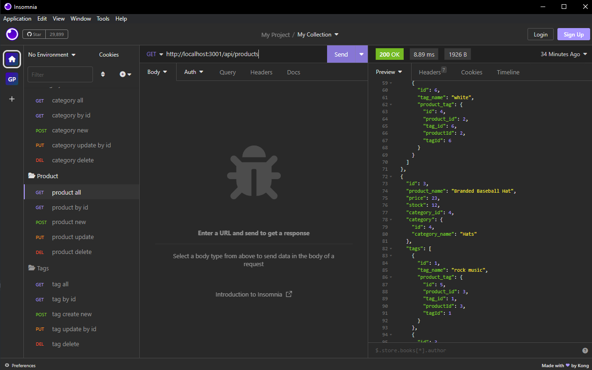
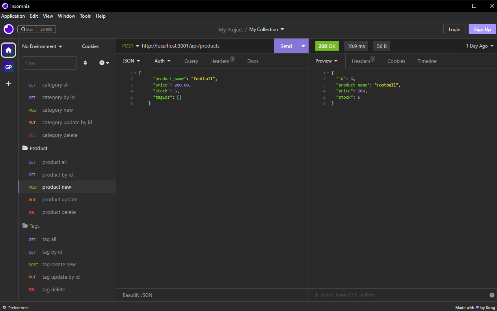

# Ecommerce-Backend

## Table of Contents:
1. [Description](#description)
2. [Installation](#installation)
3. [Setup](#setup)
4. [Contributions](#contributions)
5. [Demo](#demo)
6. [License](#license)
7. [Technologies Used](#technology)
8. [GitHub](#github)
9. [Email](#email)
  
  
## Description
This is a back end build for an ecommerce website. It allow it's user to view, modify, create, or delete by category, product or tag. The data is stored in a MySQL database. This system is designed to make inventory changes quickly and accurately.

## Installation
* Ensure NodeJS and MySQL are installed on your machine. 
* Clone the code down to your machine, open a command line, and navigate to the direcory where the application is stored. 
* Make sure your are in the root directory and type 'npm install' to install the dependencies. The program is now installed, and the next step is setup.

## Setup
Before use, we need to set up the database. 
* Ensure that you are still in the root directory for the application and log in to MySQL, or you can use a separate MySQL shell that you have navigated to the root directory. 
* After logging in, type 'source db/schema.sql' in the command prompt or the MySQL shell. This will set up the database. 
* Type 'quit'. You will be logged out of MySQL. 
* The next step is to seed the data with the seed files. 
* To do this, type 'npm run seeds' in the command line. This will seed the database with starter data that can be easily modified or deleted later. 
* Now the application is ready to use. 
* To test your GET, POST, PUT, and DELETE routes, I recommend using [Insomnia](https://insomnia.rest/download). This program allows you you test your routes, view data, and make changes to your data. 
* 
* You can make changes to your data by giving your route a body of JSON data as seen in the next image.
* 

## Contributions
Contact me through GitHub or email.

## Demo
[Click here to see a demo of startup, viewing data, and modifying data.](https://drive.google.com/file/d/1KKYkpHKDP1z-RAtjgaBIULA3NfCie62q/view)

## License
 

## Technologies Used
* [JavaScript](https://developer.mozilla.org/en-US/docs/Web/JavaScript)
* [NodeJS](https://nodejs.org/en)
* [ExpressJS](https://express.js)
* [MySQL](https://www.mysql.com/)
* [Dotenv](https://www.npmjs.com/package/dotenv?activeTab=readme)
* [Insomnia](https://insomnia.rest/download)
## Questions
For qestions about the project you can contact me at

### Github
[gsr142](https://github.com/gsr142)

### Email
[gsr142@gmail.com](gsr142@gmail.com)